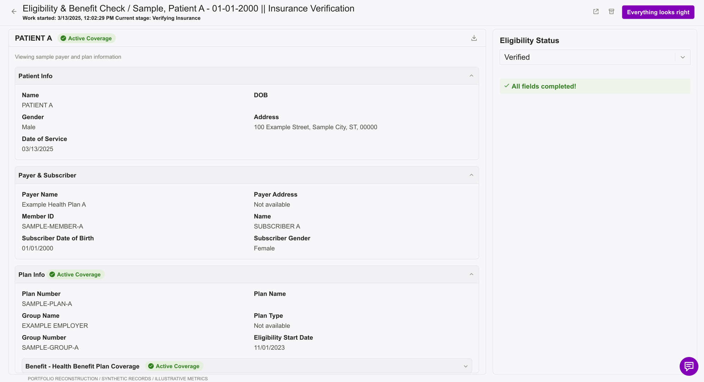
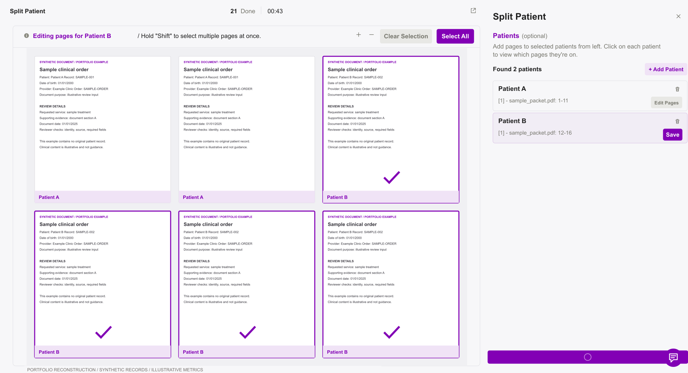
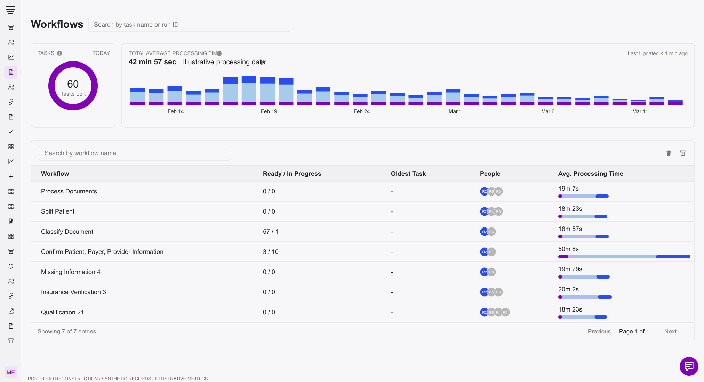

# Designing the human checkpoints in healthcare automation

[Project overview](README.md) · [Screen gallery](SCREENS.md) · [Figma board](https://www.figma.com/design/w5MWfIM7Y9mNZwHV0AfDWg?node-id=6-2)

## Context

This review experience was part of a larger ecosystem of connected healthcare workflows. Document intake established patient and document associations. Extraction turned source material into structured information. Qualification and eligibility review supported subsequent authorization work. Across the ecosystem, coding, quality-gap management, outreach, and operational oversight introduced further handoffs between automated processes and people.

My design scope focused on the review experience shown here. The broader ecosystem mattered because an unclear confirmation or unresolved record could affect the next task, not just the current screen.

## Ownership and collaboration

I was the sole designer. I conducted focused testing and shadowed technical workers, and connected with technology and operations partners at the respective hospitals to understand their feedback. My earlier Firstsource BPO experience helped me recognize the cumulative cost of backtracking, exceptions, and unclear handoffs.

Operations partners explained how they verified information and continued working when the expected path failed. Technology partners clarified available source information, integration states, and downstream behavior. My responsibility was to translate these perspectives into clear review interactions.

## What the research changed

The central problem extended beyond displaying structured output. Reviewers needed to establish where an answer came from, what confirming it meant, and how to proceed when the system could not provide an answer.

| Observed friction | Design response | Qualitative outcome |
|---|---|---|
| Repeated document searching to verify values | Evidence beside editable output, source references, highlighting, and refocus | Less searching and fewer interruptions |
| Hesitation when confirming a negative qualification result | Separate assessment outcome from review completion; explicit criteria and confirmation meaning | Clearer understanding of what confirmation does |
| Failed lookup confused with negative coverage | Distinguish unresolved verification from the result; support correction and manual recovery | More understandable recovery and handoff |

## Story 1: Evidence within reach

Reviewers moved repeatedly between extracted values and original documents. Even plausible values required supporting evidence, and checking several fields meant losing and recovering their place.

I brought source documents and editable information into the same workspace, with references and controls for highlighting and refocusing on evidence. Technology-partner input helped connect source-location information to the interface; operations feedback helped establish what reviewers needed to inspect.

The outcome was less searching and fewer interruptions during verification. The learning was that the effort of checking an answer is part of the user experience of AI, not a task outside it.

[Read the complete story](stories/01-evidence-review.md)

## Story 2: A correct negative assessment

The qualification workflow exposed individual requirements and an overall result. Reviewers could correctly conclude that a referral was Not Qualified, yet hesitate over an action labeled Everything looks right.

I separated the meaning of the assessment from the meaning of completing the review. Individual criteria and the final outcome stayed visible, while the confirmation interaction communicated that the reviewer was confirming the assessment. This also required a shared understanding with partners of what the next workflow received.

The learning was that task success and business outcome are different states. A negative assessment can be accurate, complete, and ready for the appropriate handoff.

[Read the complete story](stories/02-review-confirmation.md)

## Story 3: An unavailable answer stays unresolved

Insurance verification depended on external information. When a lookup failed, operations staff could leave the platform to investigate elsewhere. A missing input, a retrieval failure, and a completed check with a negative result required different handling.

Working with technology and operations partners, I separated verification status from coverage result and worked through recovery: correcting missing information, retrying where appropriate, or recording manual verification with its source and time. This let the next person understand what had actually been checked.

The learning was to preserve uncertainty explicitly. An integration problem must not silently become a substantive decision in the next workflow.

[Read the complete story](stories/03-verification-recovery.md)

## Designing across entities

I used a shared review structure while matching the controls to the decision. Patient splitting made page ownership spatial, including packets containing multiple patients. Document tagging reused page selection for classification. Extraction exposed editable values and diagnosis codes. Benefits and medication review grouped related fields. Qualification exposed individual criteria.

This approach created consistency across the experience without requiring every task to behave like a generic form.

## Connecting review to operations

Workflow and people views provided queue visibility, processing-time summaries, reviewer status, and membership management. They connected individual review tasks to the operational responsibility of seeing where work accumulated and who could handle it.

## Outcomes and learnings

The work made evidence easier to reach, confirmation easier to interpret, and unresolved verification easier to recover from. These are qualitative outcomes; the illustrative metrics in the screens are not project performance measurements.

My broader learning was that designing for agentic workflows means designing the boundaries between automated work and human decisions. A reviewer needs to understand the evidence, the decision they own, and what their action hands to the next step.

## About the artifacts

This case study describes the original project experience. The public gallery contains ten static screen reconstructions with synthetic records and document illustrations. It preserves captured states, including the earlier Everything looks right wording; it is not an exhaustive record of every iteration or recovery state. Individual story notes explain those distinctions. Editable SVGs are included; this repository is a design showcase, not production application code.
