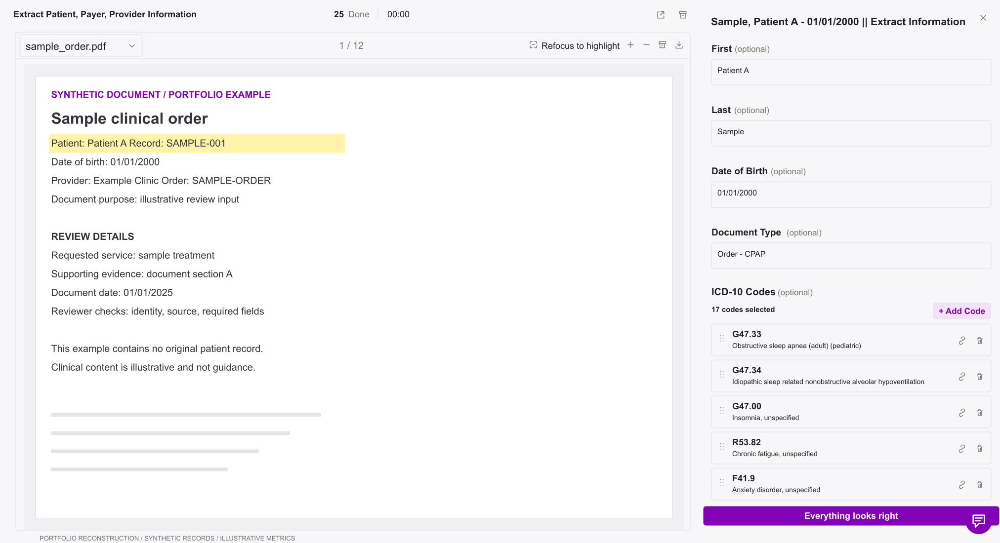
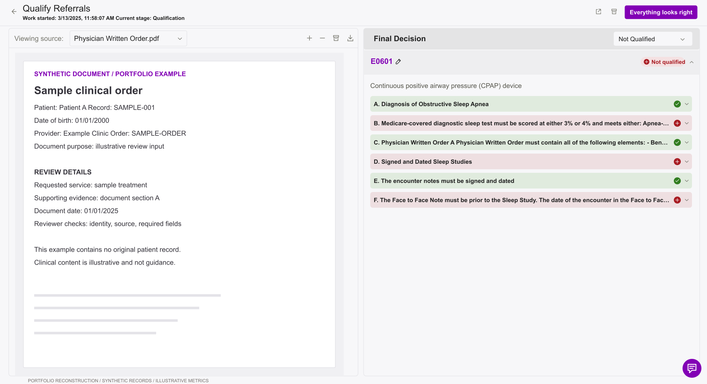

# Making AI output reviewable

**Healthcare workflow review · Original product design by Sumukh · Sole designer**

An interface for operational teams to inspect source documents, correct extracted information, and make explicit decisions before work moves forward. The project spans ten screen states, from queue management and patient splitting to benefits verification and referral qualification.

[Read the case study](CASE-STUDY.md) · [Browse all ten screens](SCREENS.md) · [Open the consolidated Figma board](https://www.figma.com/design/w5MWfIM7Y9mNZwHV0AfDWg?node-id=6-2) · [Download the public SVG board](assets/workflow-review-public.svg)

## The design challenge

Healthcare documents contain different entities, relationships, and decisions. A reviewer may need to assign pages to a patient, check an extracted field against its source, or assess individual qualification criteria. The interface needs to make that particular decision clear while keeping the supporting evidence within reach.

The organizing idea is a consistent review workspace with task-specific controls: **inspect the evidence, correct the interpretation, confirm the review**.

## One interaction that captures the project

The qualification screen can show **Not Qualified** while still offering **Everything looks right**. These represent two different decisions: the referral does not satisfy the criteria, and the reviewer confirms that this assessment is correct. A completed review can have a negative business outcome.

The criteria remain visible individually, so a single overall status does not hide which requirements passed or failed. This state is particularly useful for explaining the difference between approving an AI interpretation and approving the underlying referral.

## My role and research context

I was the sole designer of the original work. I conducted focused testing and shadowed technical workers. My earlier experience at Firstsource, a BPO company, informed how I approached operational workflows and possible exceptions.

This public case study explains the decisions visible in the design. It does not attribute a specific interface change to a particular research observation without supporting notes, or claim measured efficiency gains.

## What is included

- Ten reconstructed screen states, with PNG previews that render directly on GitHub.
- Individual editable SVGs and one consolidated SVG board.
- A case study covering evidence review, page assignment, decision states, and operational oversight.
- A screen inventory explaining what each state demonstrates.

**Public asset note:** These are portfolio reconstructions of my original interface designs. Records and document previews have been replaced with synthetic examples; timing and queue metrics are illustrative. Source-document screenshots are not included. Typography and icons are approximate. These are static designs, not a working clinical application or an interactive prototype. The Figma board retains its own access permissions.
