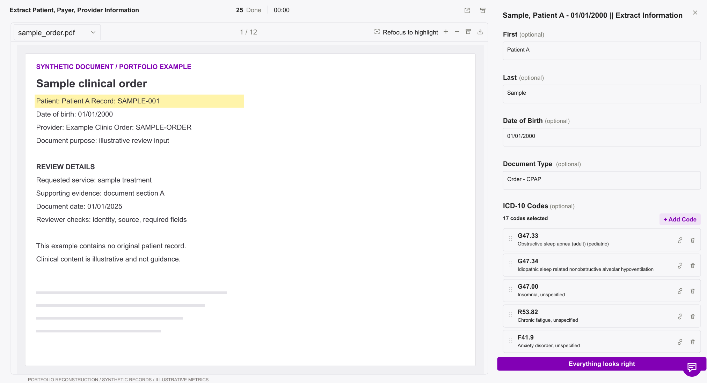
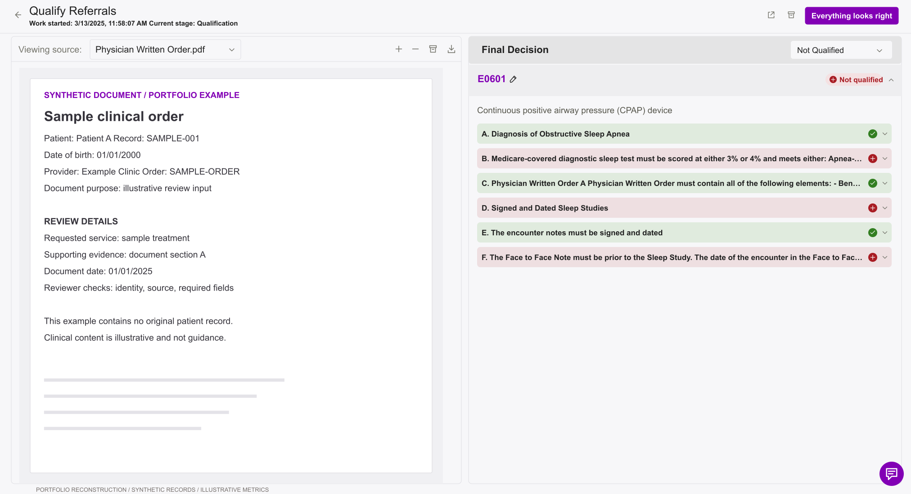

# Making AI output reviewable

**Healthcare workflow review · Original product design by Sumukh · Sole designer**

I designed the human review experience within a broader healthcare automation platform. Hospital operations teams needed to verify extracted information, correct exceptions, and make explicit decisions before work moved into the next workflow.

Working with hospital technology and operations partners, I translated feedback from focused testing and shadowing into three design priorities: make evidence accessible, make confirmation unambiguous, and make recovery understandable.

[Read the full case study](CASE-STUDY.md) · [Browse ten screens](SCREENS.md) · [Open Figma](https://www.figma.com/design/w5MWfIM7Y9mNZwHV0AfDWg?node-id=6-2) · [Download the public SVG board](assets/workflow-review-public.svg)

## Project at a glance

| Area | Scope |
|---|---|
| My role | Sole designer of the original workflow review experience |
| Partners | Hospital technology and operations teams |
| Research | Focused testing, shadowing, and partner feedback |
| Background | Previous Firstsource BPO experience informed my attention to operational exceptions and handoffs |
| Product scope | Intake, patient splitting, document tagging, extraction, eligibility, benefits, qualification, and team oversight |
| Core challenge | Help people verify and act on automated output across connected workflows |

## Three stories from the work

### 1. Make evidence accessible

Reviewers repeatedly searched source documents to verify extracted values. I brought evidence and editable output into one workspace, with source references, highlighting, and refocus controls. The result was less searching and fewer interruptions during verification.

[Read the evidence-review story and learning](stories/01-evidence-review.md)

### 2. Make confirmation unambiguous

A reviewer could reach an accurate **Not Qualified** result and still hesitate over **Everything looks right**. I separated review completion from the business outcome, keeping individual criteria and the final assessment explicit. The learning was that successful review does not necessarily mean a positive decision.

[Read the confirmation story and learning](stories/02-review-confirmation.md)

### 3. Make recovery understandable

An unsuccessful insurance lookup needed to remain distinct from a negative coverage result. With technology and operations partners, I worked through unresolved checks, missing information, and manual verification so staff could recover and the next team could understand what had been checked.

[Read the recovery story and learning](stories/03-verification-recovery.md)

## A family of review experiences

The same workspace structure supports different decisions: page grids for patient assignment and tagging, editable fields for extraction, grouped information for benefits, and criteria-level review for qualification. Workflow and people views connect individual tasks to team operations.

## Public design package

The gallery contains ten static reconstructions of my original screens, individual editable SVGs, and a consolidated board. Records and document illustrations are synthetic; dashboard metrics are illustrative. Outcomes in the case study are qualitative, with no numerical performance claims. The gallery preserves captured interface states; later refinements described in the stories are identified in their artifact notes. Typography and icons are approximate. Figma access permissions remain separate.

<!-- portfolio-future-plans:start -->
## Future plans and PRD direction

*Planning review: 24 September 2026. These are proposed next steps, not completed work or measured outcomes.*

**Priority recommendation:** Prioritize the healthcare case.

Extend the case with product decisions and evidence while preserving the original sole-designer ownership.

### Next scope

- [ ] Document the user problem, alternatives, scope choices and hospital stakeholder trade-offs for evidence review, confirmation and unresolved verification.
- [ ] Connect each interaction decision to a proposed operational measure such as review time, correction rate or handoff completeness.
- [ ] Specify a focused task-based validation plan for negative assessments, failed lookups and manual recovery.
- [ ] Cross-reference proposed human-review and exception requirements only after checking that they add to the original case.

### Validation and decision criteria

Keep original qualitative outcomes separate from future studies. Public screens remain synthetic reconstructions; do not retrospectively claim PM ownership, production changes or numerical impact that was not established.
<!-- portfolio-future-plans:end -->
