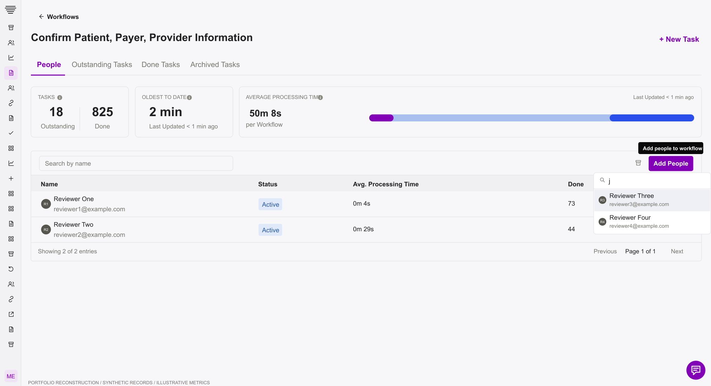
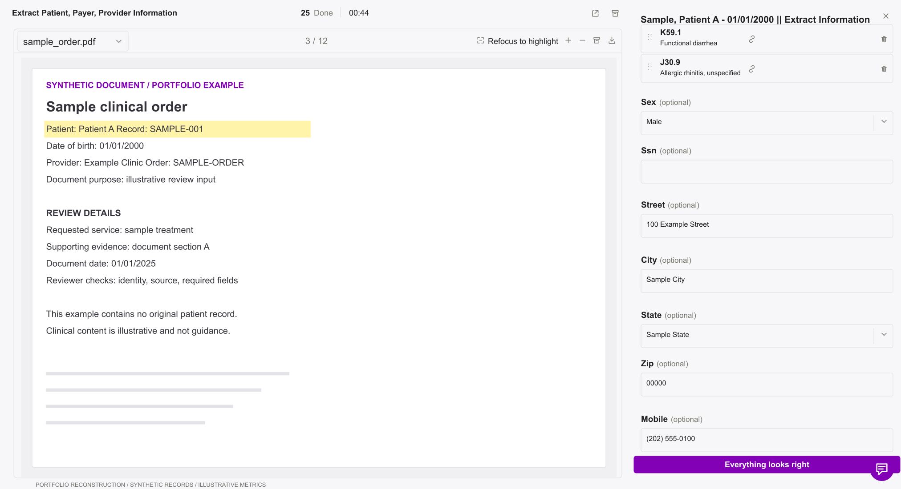
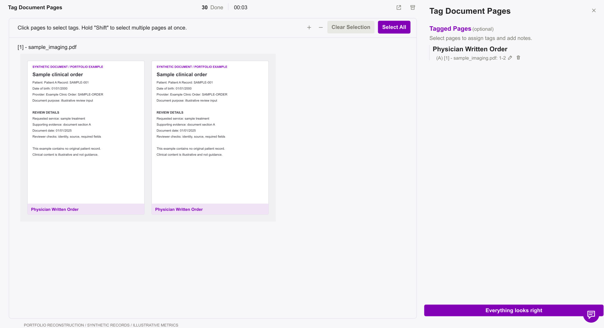
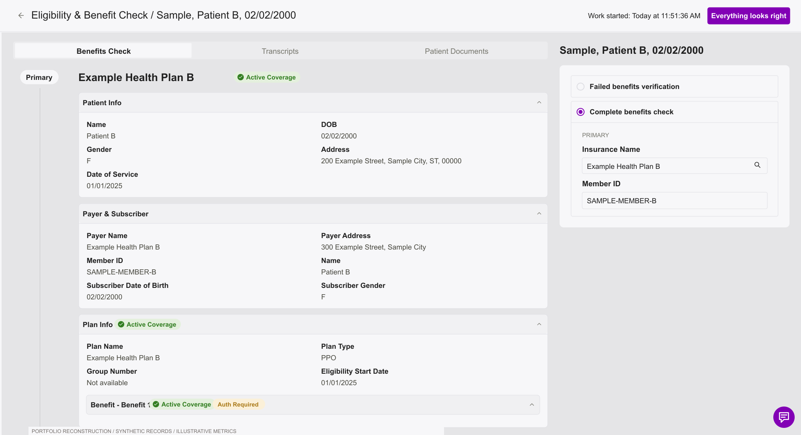
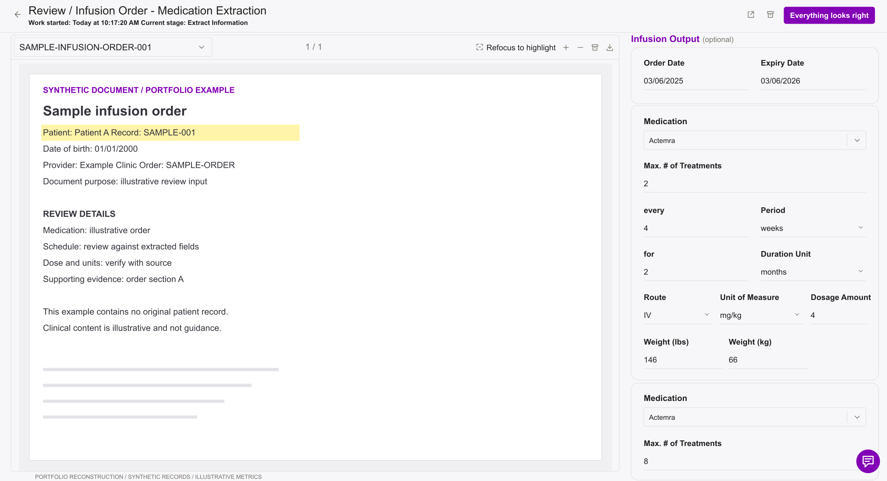

# Screen gallery

[Project overview](README.md) · [Case study](CASE-STUDY.md) · [Consolidated SVG](assets/workflow-review-public.svg)

All records, document illustrations, and operational metrics below are synthetic or illustrative. Each numbered link opens an editable SVG.

## 01 · Workflows dashboard

Queue overview, workflow membership, and processing-time summaries. [Editable SVG](assets/01-screen.svg)

## 02 · Workflow people: Add People open

Reviewer status, completed work, and the searchable membership picker. [Editable SVG](assets/02-screen.svg)

## 03 · Extraction: patient and diagnosis

Source document beside editable patient fields and diagnosis codes. [Editable SVG](assets/03-screen.svg)

## 04 · Extraction: contact details

A lower form state showing additional patient details and the persistent completion action. [Editable SVG](assets/04-screen.svg)

## 05 · Split Patient: selected pages

Page assignment across two patients, with an active edit and completion loading state. [Editable SVG](assets/05-screen.svg)

## 06 · Tag Document Pages

Page-level document classification with a matching tag summary. [Editable SVG](assets/06-screen.svg)

## 07 · Eligibility: verified

Grouped patient and plan information alongside the verification status. [Editable SVG](assets/07-screen.svg)

## 08 · Benefits check: complete

Benefits evidence beside the completion decision and insurance fields. [Editable SVG](assets/08-screen.svg)

## 09 · Qualify Referrals

Mixed criteria results and a Not Qualified outcome that can still be confirmed as correctly reviewed. [Editable SVG](assets/09-screen.svg)

## 10 · Infusion Order: Medication Extraction

Structured medication details beside a synthetic source order. [Editable SVG](assets/10-screen.svg)

