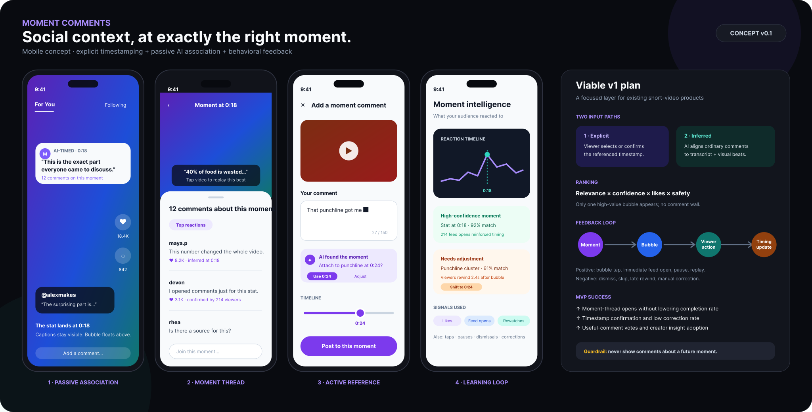

# Moment Comments

**AI-timed discussion for short video · Product concept by Sumukh**

[Open the Figma concept](https://www.figma.com/design/qMnajfGENfkplGhmD8pVNC/Moment-Comments-%25E2%2580%2594-AI-Timed-Short-Video-Concept?node-id=1-2) · [View the backed-up SVG board](assets/moment-comments-concept.svg)

Moment Comments keeps social reactions connected to the part of a short video they reference. Instead of leaving playback and searching a general comment feed, a viewer can see one relevant comment bubble at the associated moment and open the discussion for that moment.

## Problem

People often open comments immediately after a punchline, surprising statistic, claim, or visual detail to see whether others noticed or felt the same thing. The existing feed contains useful social context, but separates it from the moment that created it.

The concept treats comments as potentially related to a segment of the video rather than only to the video as a whole.

## Two ways a comment becomes moment-specific

### 1. Explicit reference

A commenter selects a moment or accepts an AI-suggested timestamp before posting. This creates a high-confidence anchor and gives the commenter a simple correction path.

### 2. Inferred reference

A viewer posts an ordinary comment. AI compares its meaning with the transcript, scene changes, visible subjects, and clusters of similar comments to estimate the relevant moment.

Likes help rank representative comments after association; they are not treated as proof of a timestamp. A highly liked comment can still be general, ambiguous, or unrelated to the current moment.

## Viewer experience

1. A video reaches a meaningful beat.
2. One concise, high-confidence comment bubble appears without covering captions or important content.
3. Tapping the bubble opens comments grouped around that moment.
4. The viewer can replay the beat, join the moment thread, dismiss the bubble, or return to the full feed.
5. Comments referring to a future part of the video are never shown early.

The first visual concept contains four states:

- Passive AI-associated bubble during playback.
- Expanded thread for one moment.
- Explicit timestamp confirmation while commenting.
- Creator-facing moment intelligence and placement feedback.

## Ranking model

The initial ranking is a product rule, not a trained production formula:

`display score = association confidence × relevance × engagement quality × safety`

Only one high-value bubble should appear at a time. A minimum confidence threshold, frequency cap, creator controls, moderation, and a hide-reactions control are required before a production test.

## Behavioral feedback loop

| Signal | Possible interpretation | Strength / caution |
|---|---|---|
| Comment-bubble tap | The surfaced comment was relevant enough to explore | Strong positive placement signal |
| Comment feed opened immediately after a moment | The moment created a need for social context | Useful but correlational; the viewer may have opened comments for another reason |
| Pause or replay near the bubble | The moment or comment deserved another look | Positive when combined with a tap; ambiguous alone |
| Several viewers open the feed at the same beat | The beat likely deserves a moment cluster | Stronger as the pattern repeats across viewers |
| Bubble dismissed or video skipped | The interruption may be irrelevant, early, or too frequent | Negative presentation or placement signal |
| Viewer adjusts the timestamp | The original association was wrong | Highest-quality corrective signal |

The system should learn from combinations of signals rather than interpreting any single scroll or pause as intent.

## Viable first release

Build this first as a layer for an existing short-video product or embeddable player, not as a new social network.

In scope:

- Transcript and scene segmentation.
- Explicit and inferred timestamp association.
- One timed bubble and one moment-thread view.
- Basic ranking, moderation, spoiler prevention, and viewer controls.
- Creator timeline showing reaction peaks and association confidence.
- Instrumentation for taps, feed opens, pauses, rewatches, dismissals, and corrections.

Out of scope for the current concept:

- A trained association model or production backend.
- A complete moderation and appeals system.
- A full creator analytics product.
- Live comments, advertising, monetization, and a new social graph.
- A componentized or clickable Figma prototype.

## What to test

- Do timed bubbles increase useful comment exploration without reducing video completion?
- Do viewers understand that a bubble represents discussion about the current moment?
- How often do explicit and inferred timestamps need correction?
- What bubble frequency feels helpful rather than distracting?
- Do creators find moment-level reaction data more actionable than aggregate comments?

Primary measures should include moment-thread open rate, completion rate, timestamp confirmation and correction rates, bubble dismissals, and usefulness votes. No user-research or outcome claims have been made yet.

## Artifact status

Created 20 September 2026. The Figma file is a visually verified concept frame imported as editable SVG vectors. The local SVG is an export of that frame for checkpoint and review purposes. The concept is not yet connected as a prototype and has no live AI or video integration. Figma remains the editable source; repository assets are backups and public documentation.
