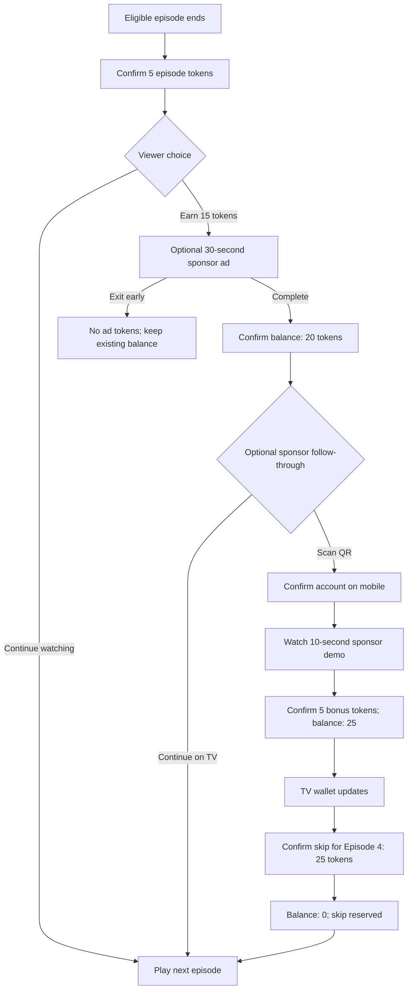

# Watch & Unlock

### A concept case study for rewarded advertising on an OTT streaming platform

[← Project overview](README.md) · [Wireframe notes](WIREFRAMES.md) · [Screen gallery](SCREENS.md)

> **Project status:** Product concept, Figma design brief, and 28-screen grayscale wireframe checkpoint. No user research, usability testing, commercial partnerships, or performance results have been completed. Token values and success thresholds are hypotheses for validation.

| Item | Scope |
| --- | --- |
| Product | Watch & Unlock |
| Platform | Fictional OTT streaming service called Streamly |
| Primary experience | Connected TV, operated with a remote |
| Companion experience | Mobile web for optional advertiser follow-through |
| Audience | Adult viewers on an advertising-supported plan |
| Deliverable | Figma screens, component library, and clickable prototype |
| Core value | Earn credits through optional advertising engagement and spend them on viewing benefits |

## 1. Product overview

Watch & Unlock gives viewers a choice in how they exchange attention for streaming benefits. They receive a small token reward after an eligible episode, can earn more by completing an optional advertisement, and can receive a follow-up bonus by exploring the sponsor’s content. Tokens can then unlock benefits such as skipping an eligible ad break or temporarily improving video quality.

The design should communicate three things at every decision point:

1. What action the viewer is choosing.
2. Exactly how many tokens the action earns or costs.
3. When and where the resulting benefit applies.

**Product promise:** “Watch a little. Unlock more.”

**Supporting explanation:** “Earn tokens from optional sponsor ads. Use them for ad skips and other viewing rewards.”

## 2. Problem and opportunity

The hypothesis behind this concept is that viewers may be more receptive to advertising when they can choose the exchange and understand the benefit. Standard ad interruptions give viewers little control over when attention is exchanged or how it benefits them.

Advertisers may value viewers who deliberately choose to watch and explore an offer. The streaming platform needs the resulting advertising revenue to cover rewards, delivery costs, and any advertising revenue displaced by redemption.

These are assumptions to test, rather than established research findings.

### Design challenge

How might we let viewers earn meaningful viewing benefits through optional advertising, while keeping the viewing experience simple, the sponsor interaction transparent, and the rewards financially sustainable?

### Goals

- Make earning and spending understandable within one short viewing session.
- Give viewers a useful reward after a modest amount of engagement.
- Offer a clear path back to entertainment at every step.
- Support TV remote navigation and mobile sponsor exploration.
- Distinguish an earned reward from a pending or unavailable reward.

### Out of scope

- Cash withdrawals, token trading, cryptocurrency, and transfers between accounts.
- Purchases as a requirement for earning a follow-up bonus.
- Reward flows for child profiles in the initial concept.
- Real advertising integrations, payment processing, and production fraud detection.

## 3. Audience and jobs to be done

These are provisional audience segments for concept design, not research-derived personas.

| Audience | Situation | Job to be done |
| --- | --- | --- |
| Budget-conscious viewer | Uses an ad-supported plan | “Let me earn a small premium benefit without starting a subscription.” |
| Intentional binge viewer | Wants fewer interruptions in the next episode | “Let me watch a sponsor ad now so I can skip an ad break later.” |
| Curious viewer | Finds a sponsor or trailer relevant | “Let me explore it on my phone without losing my place on the TV.” |

## 4. Experience principles

1. **Choice before commitment.** Present the action, duration, and reward before starting.
2. **Entertainment stays central.** The next episode remains easy to reach.
3. **Visible accounting.** Show exact balances, transaction status, and reward deductions.
4. **Calm motivation.** Use restrained celebrations. Avoid leaderboards, streak penalties, countdown pressure, and slot-machine imagery.
5. **Specific promises.** Say “Skip one ad break in this episode,” rather than implying an entire episode will be ad-free.
6. **Honest sponsorship.** Label advertisements and sponsored destinations clearly.

## 5. Proposed token economy

All amounts are illustrative and should be configurable during a pilot.

### Earn

| Action | Reward | Proposed rule |
| --- | ---: | --- |
| Complete an eligible episode | 5 tokens | Once per episode per account; maximum two episode rewards per day |
| Complete an optional sponsor ad | 15 tokens | Reward after verified completion; maximum four rewarded ads per day |
| Complete sponsor follow-through | 5 tokens | Once per qualifying ad session; maximum four follow-up bonuses per day |

The illustrative maximum is 90 tokens per day. Replaying an already rewarded episode does not earn another completion reward. Ad availability may reduce the number of earning opportunities.

### Spend

| Reward | Cost | Exact scope shown in the interface |
| --- | ---: | --- |
| Skip one eligible ad break | 25 tokens | The next eligible break in the selected episode |
| HD for one eligible episode | 50 tokens | Up to 1080p for that episode, subject to device and connection support |
| Unlock one eligible premium episode | 80 tokens | Access to the selected episode for 24 hours after activation |
| 24-hour ad-free pass | 200 tokens | Eligible on-demand titles; exclusions shown before redemption |

**MVP:** Ship rewarded ad completion and the 25-token ad-break skip first. The full concept mocks may show episode tokens and the follow-up bonus, clearly identified as later pilot scope. HD, premium episode access, and the pass belong in a separate future-rewards exploration.

### Accounting rules for the concept

- Tokens belong to the account. Activity displays the profile that earned or redeemed them.
- Tokens have no cash value and cannot be transferred.
- No token expiration is assumed for this prototype.
- A pending reward does not increase the spendable balance.
- Only successful, eligible redemption deducts tokens.
- Duplicate completion callbacks cannot award tokens twice.
- A failed reward activation leaves the balance unchanged or creates a visible refund if a deduction already occurred.
- A redeemed ad-break skip is reserved for the selected episode. If it cannot be delivered or remains unused for 24 hours, refund the tokens.
- Daily limits follow the account timezone and show a local reset time when reached.

### Follow-through definition

Opening a QR code or sponsor link alone does not earn the bonus. For the prototype, the viewer must watch a 10-second product demo on a platform-hosted sponsor page. Explain that requirement before the QR handoff. Opening the page requires no purchase or newsletter registration.

The mobile page must confirm the correct streaming account before crediting the reward. Use a short-lived claim session and account confirmation; the QR image must not expose account details. The production security implementation is outside the mockup scope.

## 6. Canonical prototype scenario

Use this scenario across every screen so the prototype has consistent balances.

| Step | Event | Balance |
| --- | --- | ---: |
| 1 | Viewer finishes an eligible episode with no existing tokens | 0 |
| 2 | Episode completion reward is confirmed | 5 |
| 3 | Viewer completes a 30-second sponsor ad | 20 |
| 4 | Viewer watches the sponsor’s 10-second demo on mobile | 25 |
| 5 | Viewer redeems one ad-break skip for the next episode | 0 |
| 6 | Next episode begins with the skip benefit reserved | 0 |

Use fictional content and advertisers: **Afterlight — Season 1, Episode 3**, next episode **Episode 4**, and sponsor **Northstar Audio**. Use original or licensed placeholder artwork and clearly fictional brand assets.

## 7. Information architecture

```text
Streamly
├── Home
├── Series detail
├── Player
│   ├── Episode completion
│   ├── Optional sponsor offer
│   ├── Rewarded ad player
│   └── Return to episode / next episode
├── Rewards
│   ├── Wallet balance
│   ├── Available rewards
│   ├── Redemption confirmation
│   └── Token activity
└── Account
    └── Reward preferences and explanations

Mobile sponsor handoff
├── Account confirmation
├── Sponsor demo
└── Bonus confirmation
```

## 8. Main user flow



## 9. Figma file setup

Create the following pages in order:

| Figma page | Contents |
| --- | --- |
| `00 — Read me` | Concept status, brief, assumptions, scope, prototype start points |
| `01 — Foundations` | Color, typography, spacing, icon, focus, and motion tokens |
| `02 — Components` | Reusable components and state variants |
| `03 — Flows` | Main journey, exits, failures, and balance transitions |
| `04 — TV screens` | High-fidelity connected-TV experience |
| `05 — Mobile handoff` | Mobile sponsor continuation and confirmation |
| `06 — Edge states` | Pending, unavailable, failure, and insufficient-balance states |
| `07 — Prototype` | Ordered presentation frames and connected demo flows |
| `08 — Handoff` | Behavior notes, copy, event map, and open questions |

Name frames using `TV-01 / Episode complete / 5 tokens` or `M-03 / Bonus confirmed / 25 tokens`. Place annotations outside the product frame. Use Auto Layout, shared variables, and component instances throughout.

## 10. Visual design direction

Aim for a cinematic streaming interface with a quiet rewards layer. Dark surfaces keep artwork central; a warm token accent marks earning and spending. Use a simple circular token icon without dollar signs or cryptocurrency cues.

### Color tokens

| Token | Value | Intended use |
| --- | --- | --- |
| `background/base` | `#0B1018` | App and player background |
| `surface/default` | `#151E2D` | Cards and dialogs |
| `surface/raised` | `#213047` | Selected panels |
| `text/primary` | `#F7F9FC` | Headings and main copy |
| `text/secondary` | `#B8C4D6` | Supporting text |
| `accent/action` | `#8DB4FF` | Primary action fill |
| `accent/token` | `#FFD166` | Token icon and reward amounts |
| `status/success` | `#7FE0AD` | Confirmed reward status |
| `status/error` | `#FF9C9C` | Failure messages |
| `focus/ring` | `#FFFFFF` | TV keyboard and remote focus |

Use dark text on the light action and token fills. Verify actual foreground/background combinations for accessibility before handoff; this palette is a starting specification, not an audited result. Do not convey state through color alone.

### Typography

Use **Inter** throughout, with regular, medium, and semibold weights.

| Style | TV size / line height | Mobile size / line height |
| --- | --- | --- |
| Display | 56 / 64 | 32 / 40 |
| Screen title | 44 / 52 | 28 / 36 |
| Section title | 32 / 40 | 22 / 28 |
| Body | 26 / 36 | 16 / 24 |
| Button | 26 / 32 | 16 / 24 |
| Supporting label | 22 / 30 | 14 / 20 |
| Wallet balance | 64 / 72 | 40 / 48 |

### Layout

- TV frames: **1920 × 1080**, 96 px horizontal margins, 60 px vertical margins, 12 columns, 24 px gutters.
- Mobile frames: **390 × 844**, 20 px horizontal margins, four columns, 16 px gutters. Let longer content scroll.
- Spacing scale: **4, 8, 12, 16, 24, 32, 48, 64, 96**.
- Card radius: 20 px TV, 16 px mobile. Button radius: 12 px.
- TV buttons: minimum 72 px height. Mobile buttons: minimum 48 px height.
- TV dialogs: approximately 800–960 px wide, centered, with 48 px padding.
- Use a strong dark scrim behind text over imagery. Avoid text over detailed faces or bright artwork.

### Motion and remote focus

- Focused TV controls receive a 4 px white outer ring with a 4 px offset. A subtle 1.02 scale change is optional.
- Focus transitions: approximately 150 ms. Dialog and toast transitions: approximately 200 ms.
- Reward confirmation: a short icon check and count change, under 500 ms. Avoid full-screen confetti.
- Provide a reduced-motion alternative with immediate state changes.
- Document directional focus order on every TV frame. Back closes the current overlay and restores focus to the originating control.
- Where Figma does not support the target remote behavior, use keyboard triggers or separate focus-state frames and annotate intended device behavior.

## 11. Component library

| Component | Variants and required behavior |
| --- | --- |
| `Button` | Primary, secondary, text; default, focused, pressed, disabled, loading |
| `TokenBalance` | Compact header and expanded wallet; confirmed and syncing |
| `EarnCard` | Available, focused, completed, limit reached, unavailable |
| `RewardCard` | Affordable, insufficient balance, unavailable, active |
| `RewardAmount` | Earn, spend, pending; explicit plus/minus and token label |
| `AdProgress` | Playing, paused, buffering, completed; separate from main-content progress |
| `SponsorLabel` | Sponsor name and explicit “Sponsored” label |
| `QRHandoff` | Ready, connected, expired, complete; QR and short URL alternative |
| `ConfirmationDialog` | Reward scope, cost, balance before/after, confirm, cancel |
| `StatusNotice` | Information, success, warning, error; icon plus text |
| `TransactionRow` | Earned, spent, pending, refunded; amount, action, profile, timestamp |
| `BenefitBadge` | Reserved, applied, refunded; identifies the episode and reward |

Use component properties for labels, amounts, icons, sponsor name, and reward scope. Keep monetary-style token formatting consistent: “25 tokens,” never “$25.”

## 12. Screen-by-screen design specifications

### TV-01 — Episode complete

**Purpose:** Award the episode tokens and offer a voluntary next step.

**Layout:** Use the episode artwork as a dimmed full-frame background. Place completion information on the left and an approximately 560 px-wide sponsor card on the right. Keep the wallet in the top-right header area.

**Copy and content:**

- Heading: “Episode complete”
- Content label: “Afterlight · Season 1, Episode 3”
- Status: “You earned 5 tokens”
- Wallet: “5 tokens”
- Main action: “Play Episode 4”
- Sponsor card: “Earn 15 more tokens”
- Explanation: “Watch a 30-second ad from Northstar Audio.”
- Sponsor action: “Watch ad · +15 tokens”
- Secondary link: “How tokens work”

**Behavior:** Default focus is on “Play Episode 4.” The offer does not start automatically. If the existing product uses autoplay, offer a visible pause control and pause the countdown when the viewer focuses or opens the reward offer. The clickable prototype starts with autoplay paused.

### TV-02 — Rewarded ad player

**Purpose:** Make ad duration and completion requirements clear.

**Layout:** Full-frame ad creative, with a sponsor label at the top left and “Earn 15 tokens” at the top right. Bottom controls include playback status, time remaining, captions, and a visible exit action.

**Copy:** “Sponsored · Northstar Audio”; “Ad · 00:18 remaining”; “Complete this ad to earn 15 tokens.”

**Behavior:** Count only eligible playback time. Pausing or buffering pauses progress. Early exit is allowed. Back opens a dialog: “Leave this ad? You won’t earn the 15 ad tokens. Your 5 existing tokens are safe.” Actions: “Keep watching” and “Leave ad.” Completion proceeds to confirmation only after the reward is confirmed; otherwise use the pending state.

### TV-03 — Ad reward confirmed

**Purpose:** Confirm the earned value and offer optional follow-through.

**Layout:** Two columns. Left: success icon, earned amount, updated balance, and continue action. Right: sponsor card with a QR handoff entry.

**Copy:**

- Heading: “15 tokens added”
- Wallet: “20 tokens”
- Supporting copy: “You’re 5 tokens away from skipping an ad break.”
- Main action: “Play Episode 4”
- Sponsor card: “Earn 5 more tokens”
- Requirement: “Scan with your phone and watch a 10-second Northstar Audio demo.”
- Action: “Show QR code”
- Supporting line: “No purchase required.”

**Behavior:** Default focus remains on the continue action. Opening the QR panel preserves the 20-token balance. The bonus is not awarded for scanning alone.

### TV-04 — Continue on your phone

**Purpose:** Move optional sponsor engagement to a more suitable device.

**Layout:** Centered 880 px dialog. Large QR area on the left; numbered instructions on the right. Use a 280 × 280 px high-contrast QR placeholder with a quiet white border. Replace it with a valid code only if a real prototype destination exists.

**Copy:** “Explore Northstar Audio”; “1. Scan the code. 2. Confirm your Streamly account. 3. Watch the 10-second demo to earn 5 tokens.” Include “Or visit streamly.example/reward and enter DEMO25.” This is a fictional address and code for mockups.

**States:** “Waiting for your phone,” “Phone connected,” “Bonus confirmed,” and “Code expired.”

**Behavior:** Offer “Back to TV.” The TV balance updates when the bonus is confirmed. Expired sessions show “Generate new code.” If the viewer resumes playback, use a nonblocking confirmation toast when the bonus arrives.

### M-01 — Sponsor landing and account confirmation

**Purpose:** Explain the bonus and ensure it reaches the correct account.

**Layout:** Streamly header, sponsored content label, product image, concise reward requirement, account confirmation area, and bottom action.

**Copy:** “Explore Northstar Audio”; “Watch this 10-second demo to earn 5 Streamly tokens”; “Credit tokens to Alex’s account?”; primary action “Confirm and watch demo.” Include a “Use another account” link and “No purchase required.”

**Behavior:** An unauthenticated viewer sees “Sign in to claim tokens.” Preserve the claim session through sign-in. Do not expose another person’s account information through the QR link.

### M-02 — Sponsor demo

**Purpose:** Deliver the qualifying follow-up interaction.

**Layout:** Sponsor title, accessible video player, visible demo progress, requirement explanation, and optional external product link below the player.

**Copy:** “Your bonus unlocks when the demo finishes.” External action: “Visit Northstar Audio website,” with an external-link icon.

**Behavior:** The demo begins after the explicit action on M-01. Pause and buffering pause completion progress. Visiting the sponsor website is optional and earns no additional tokens. Keep captions and playback controls available.

### M-03 — Bonus confirmed

**Purpose:** Close the mobile loop and direct the viewer back to TV.

**Copy:** “5 tokens added”; “Your balance is now 25 tokens”; “Your TV wallet will update automatically.” Main action: “Done.” Optional secondary action: “Explore Northstar Audio.”

**Behavior:** Completing again does not award a duplicate bonus. Include a separate pending variant: “Demo complete. We’re confirming your 5 tokens.” Keep the spendable balance at 20 until confirmation.

### TV-05 — Wallet and rewards

**Purpose:** Explain the balance and make redemption discoverable.

**Layout:** Header with “Rewards” and the 25-token balance; a large available ad-skip card; a compact activity preview beneath it. Place future rewards on a separate exploration frame, rather than suggesting unavailable features work in the pilot.

**Copy:** “Choose your next reward”; “Skip one ad break”; “25 tokens”; “Applies to the next eligible ad break in Afterlight · Episode 4.” Main action: “Use 25 tokens.” Activity link: “View token activity.”

**Behavior:** Show availability for the selected episode before allowing redemption. At 20 tokens, change the card to “5 more tokens needed” and provide “See ways to earn.” Do not display a functioning redemption action when funds are insufficient.

### TV-06 — Confirm redemption

**Purpose:** Make the cost and benefit explicit before spending.

**Copy:**

- Heading: “Skip one ad break?”
- Scope: “Use this reward for the next eligible ad break in Afterlight · Season 1, Episode 4.”
- Cost: “25 tokens”
- Balance line: “Your balance: 25 → 0 tokens”
- Supporting copy: “Other ad breaks may still play. If the skip is unused for 24 hours, your tokens return automatically.”
- Actions: “Confirm · 25 tokens” and “Cancel”

**Behavior:** Default focus is on Cancel. Confirm enters a loading state and prevents duplicate submissions. Validate current balance and reward eligibility before deduction. Success opens TV-07; failure preserves the wallet and explains what happened.

### TV-07 — Reward activated

**Purpose:** Confirm what the viewer now owns and start playback.

**Copy:** “Your ad-break skip is ready”; “Reserved for Afterlight · Episode 4”; “Balance: 0 tokens.” Main action: “Play Episode 4.” Secondary action: “Back to rewards.”

**Behavior:** During episode playback, show a brief “Ad-break skip ready” badge. At the skipped break, show “Ad break skipped with tokens” without delaying playback. Mark the benefit as applied in activity. Do not imply the entire episode is ad-free.

### TV-08 — Token activity

**Purpose:** Give viewers a transparent record.

Use a scrollable list with date grouping and these rows:

| Activity | Amount | Status |
| --- | ---: | --- |
| Afterlight · Episode 3 completed | +5 | Earned |
| Northstar Audio ad completed | +15 | Earned |
| Northstar Audio demo completed | +5 | Earned |
| Ad-break skip · Afterlight Episode 4 | −25 | Reserved |

Show the profile and timestamp in each row. Selecting the redemption row opens its scope and status. Provide pending and refund variants. A refunded transaction should explain the reason and reference the original redemption.

## 13. Required edge-state frames

| State | User-facing message | Available action |
| --- | --- | --- |
| No rewarded ad available | “No reward ads are available right now.” | Continue watching |
| Daily ad limit reached | “You’ve earned today’s ad rewards. More are available after [local time].” | View rewards or continue |
| Ad interrupted | “The ad didn’t finish. No ad tokens were added.” | Retry if available or continue |
| Completion pending | “Ad complete. We’re confirming your 15 tokens.” | Continue; inspect pending activity |
| QR expired | “This code has expired.” | Generate new code |
| Bonus already claimed | “You already earned this bonus.” | View wallet |
| Insufficient balance | “You need 5 more tokens for this reward.” | See ways to earn |
| Reward no longer eligible | “This episode isn’t eligible for this reward. No tokens were spent.” | Choose another eligible reward |
| Redemption request unresolved | “We’re checking whether your reward activated.” | View status; prevent duplicate spend |
| Unused skip refunded | “25 tokens returned. Your ad-break skip wasn’t used.” | View activity |
| HD unavailable | “HD rewards aren’t available on this device or title.” | View other rewards |
| Wallet changed on another device | “Your balance has changed. Review the updated total.” | Review before confirming |

## 14. Accessibility and usability requirements

- Test text and control contrast against the relevant accessibility requirements; document verified results in handoff.
- Make every TV action reachable with directional navigation, Select, and Back.
- Keep focus visible and restore it after overlays close.
- Avoid hover-only information and interactions that require a precise pointer.
- Label token amounts, reward status, and controls for assistive technology.
- Provide captions for the ad and demo; supply text equivalents for essential promotional information.
- Provide a short URL and code alongside the QR handoff.
- Avoid rewarding sound being enabled or requiring unnecessary device permissions.
- Keep important copy readable at TV viewing distance and allow mobile text enlargement without clipping.
- Allow the viewer to dismiss reward prompts and reduce how often they appear in preferences.

## 15. Prototype instructions

Build one main prototype and three alternate paths.

**Main path:** TV-01 → TV-02 → TV-03 → TV-04 → M-01 → M-02 → M-03 → TV-05 → TV-06 → TV-07 → playback benefit state.

**Alternate path A:** Decline the ad on TV-01 and continue to Episode 4 with 5 tokens.

**Alternate path B:** Start the ad, exit early, and return with the original 5 tokens.

**Alternate path C:** Complete the ad, skip sponsor follow-through, and view the 20-token wallet with the insufficient-balance state.

Use explicit prototype-only transition controls outside the product frame to simulate ad completion and mobile-to-TV handoff. A single-device Figma prototype does not demonstrate real cross-device synchronization. Annotate simulated events so reviewers understand the boundary.

Use variables such as `tokenBalance`, `adRewardStatus`, `bonusStatus`, and `skipStatus` where practical. Otherwise use distinct, clearly named state frames. Do not let the prototype change balances inconsistently between paths.

## 16. Measurement plan

No results are claimed. The pilot should assess the complete value exchange, rather than optimizing clicks alone.

| Metric | Definition / purpose |
| --- | --- |
| Offer acceptance | Rewarded ad starts divided by eligible offer impressions |
| Ad completion | Verified completions divided by rewarded ad starts |
| Follow-through completion | Verified demo completions divided by follow-through offer impressions |
| Reward redemption | Share of token-earning accounts that redeem a reward in a defined period |
| Time to first useful reward | Time between first earning event and first successful redemption |
| Reward delivery reliability | Successfully delivered benefits divided by confirmed redemptions |
| Net contribution per viewer | Incremental revenue minus delivery costs, reward costs, and displaced revenue, avoiding double counting |
| Viewer experience | Comprehension, perceived control, satisfaction, abandonment, and complaints |
| Subscription impact | Changes in upgrades, downgrades, and cancellations compared with a suitable control |
| Advertiser quality | Qualified engagement and advertiser-defined outcomes, with rewarded traffic identified |

Suggested event names: `reward_offer_viewed`, `reward_ad_started`, `reward_ad_completed`, `token_credit_confirmed`, `sponsor_handoff_opened`, `sponsor_demo_completed`, `reward_redemption_requested`, `reward_redemption_confirmed`, `reward_applied`, and `token_refund_confirmed`.

Include event identifiers and account/session linkage necessary for reliable counting. Avoid personal information in analytics payloads unless specifically justified and governed. Production instrumentation requires a separate data design.

## 17. Usability validation plan

Recruit a small initial group of adult ad-supported streaming viewers, including people who regularly watch on TV. Treat findings as qualitative input rather than representative market evidence.

Ask participants to:

1. Explain how tokens work after viewing the first offer.
2. Continue to the next episode without accepting an ad.
3. Earn enough tokens to skip one ad break.
4. Explain whether scanning alone earns the bonus.
5. Describe exactly what the ad-skip reward covers before redeeming it.
6. Recover from an interrupted ad or an expired QR code.
7. Find the record of a refund.

Observe hesitation, missed controls, focus navigation failures, misunderstanding of rewards, and perceived pressure. Revise copy and flow before using conversion metrics to judge the concept.

## 18. Risks and open decisions

| Question | Why it matters |
| --- | --- |
| Can advertiser revenue fund a useful reward? | Determines sustainable token prices and earning rates |
| Do follow-up demos attract useful interest? | Incentivized completion may not translate into advertiser value |
| Is QR handoff worth the effort? | Mobile continuation may introduce too much friction for a small reward |
| Should episode completion earn tokens? | Free issuance increases reward cost and may encourage unnecessary viewing |
| Which titles and ad breaks are eligible? | Content contracts and ad delivery capabilities may constrain rewards |
| How does account sharing affect balances? | Shared spending needs understandable activity and concurrent balance handling |
| Does the feature weaken subscription value? | Premium sampling could increase upgrades or replace them |

## 19. Figma completion checklist

- [ ] Foundations and component variants are defined.
- [ ] Eight TV screens and three mobile screens are complete.
- [ ] Main flow and three alternate flows are connected.
- [ ] Balances follow the canonical scenario exactly.
- [ ] Every reward states its cost, scope, and eligibility.
- [ ] Every TV screen includes focus and Back behavior annotations.
- [ ] Pending, failure, insufficient-balance, and refund states are designed.
- [ ] QR handoff includes an accessible alternative.
- [ ] Sponsor follow-through is optional and clearly explained.
- [ ] Future rewards are separated from the functional pilot prototype.
- [ ] Concept assumptions and simulated interactions are labeled.
- [ ] No invented research findings or performance claims appear in the case study.

## 20. Suggested GitHub presentation

Use this document as the repository `README.md`. Add a cinematic cover image first, then screenshots at the relevant flow sections after the Figma mocks exist.

```text
watch-and-unlock/
├── README.md
├── assets/
│   ├── cover.png
│   ├── tv-episode-complete.png
│   ├── tv-ad-reward.png
│   ├── mobile-sponsor-demo.png
│   ├── tv-wallet.png
│   └── tv-redemption.png
└── design/
    ├── prototype-notes.md
    └── usability-findings.md
```

Add a Figma file link and prototype link near the top only after they exist. When usability work is completed, add actual methods and findings, clearly distinguished from the assumptions in this concept.
