# Watch & Unlock — Screen gallery

[← Project overview](README.md) · [Interaction notes](WIREFRAMES.md)

All screens are grayscale concept wireframes. Token balances are scenario states, not a live account.

## TV-01 — Episode complete

**Spendable balance: 5 tokens.** Default focus: Play Episode 4. Right moves to the voluntary ad offer. No autoplay countdown in this wireframe.

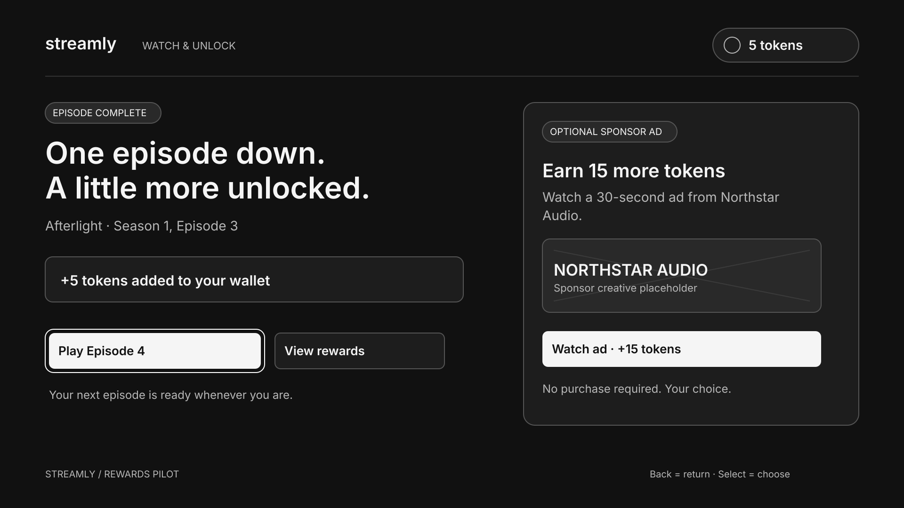

## TV-02 — Optional sponsor ad

**Spendable balance: 5 tokens.** Prototype simulation: use the review toolbar to complete the ad. Real earning requires confirmed completion. Exit preserves the 5-token balance.

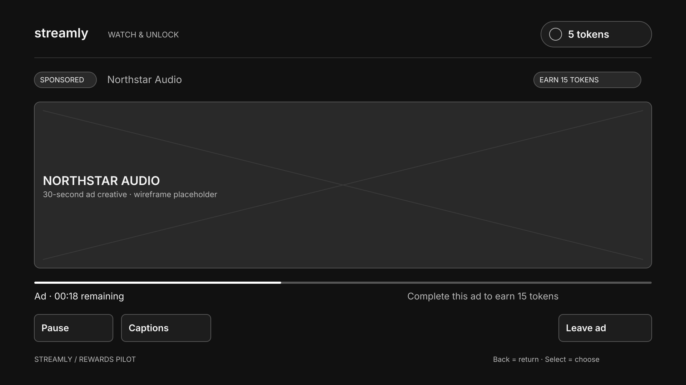

## TV-03 — Ad reward confirmed

**Spendable balance: 20 tokens.** Continue stays the easiest action. Scanning the QR code does not earn tokens; the optional 10-second demo does.

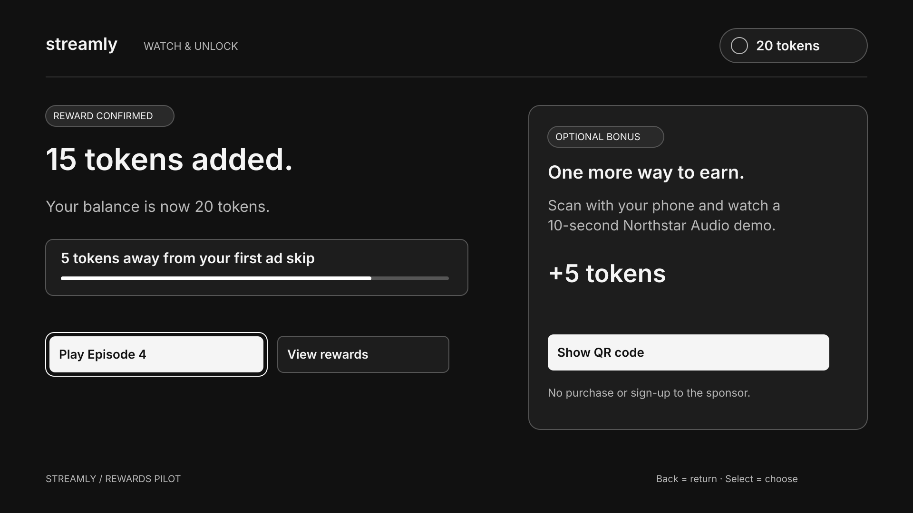

## TV-04 — Continue on your phone

**Spendable balance: 20 tokens.** The QR region is deliberately a labeled placeholder. Use “Simulate phone handoff” in the review toolbar. Back returns to TV-03.

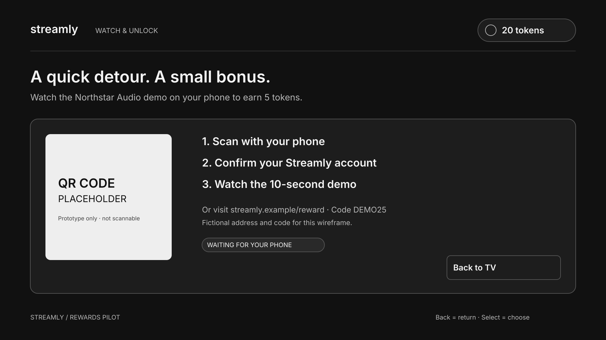

## TV-05 — Wallet and rewards

**Spendable balance: 25 tokens.** Reward availability is checked for Episode 4. Prices are illustrative. HD and other premium rewards are a future exploration.

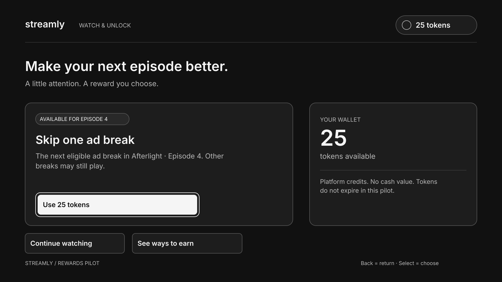

## TV-06 — Confirm redemption

**Spendable balance: 25 tokens.** Default focus: Cancel. Token deduction occurs only after activation succeeds. This reward skips exactly one eligible break.

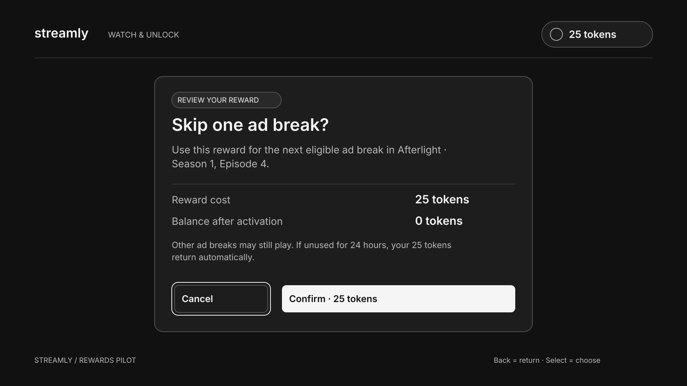

## TV-07 — Reward activated

**Spendable balance: 0 tokens.** 25 tokens spent. The benefit is reserved for Episode 4. The prototype toolbar can simulate delivery at the next eligible break.

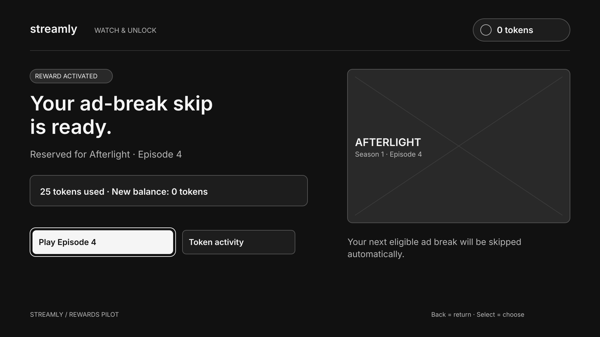

## TV-08 — Token activity

**Spendable balance: 0 tokens.** Account wallet. Each transaction identifies profile and status. Reserved changes to Applied after the break is skipped.

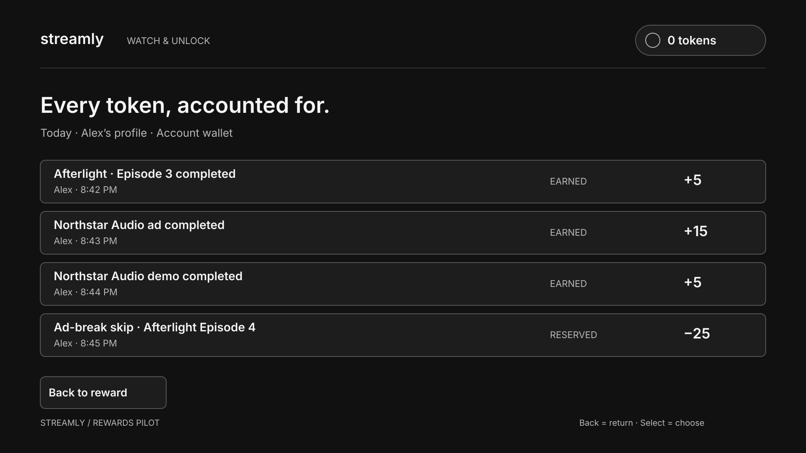

## M-01 — Confirm account on phone

**Spendable balance: 20 tokens.** Signed-in account shown only after authentication. “Use another account” opens the sign-in variant.

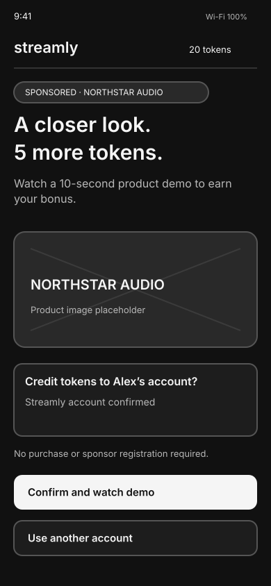

## M-02 — Watch sponsor demo

**Spendable balance: 20 tokens.** Review toolbar simulates completion. Playback controls are illustrative; this wireframe has no real video.

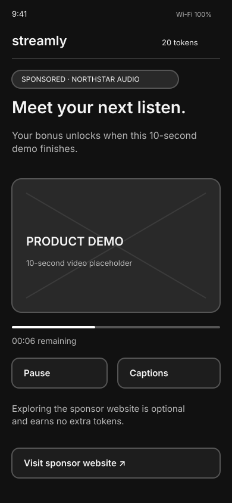

## M-03 — Mobile bonus confirmed

**Spendable balance: 25 tokens.** Bonus is credited once per qualifying ad session. “Return to TV” in the review toolbar simulates cross-device sync.

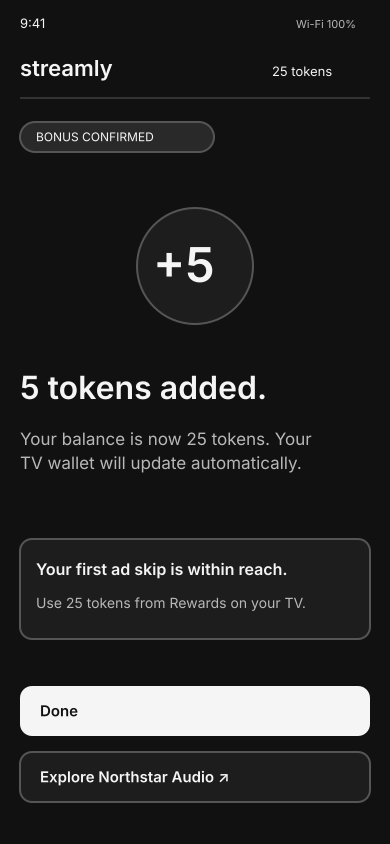

## M-SIGNIN — Sign in to claim tokens

**Spendable balance: 20 tokens.** Authentication is simulated. No passwords are collected or sent anywhere.

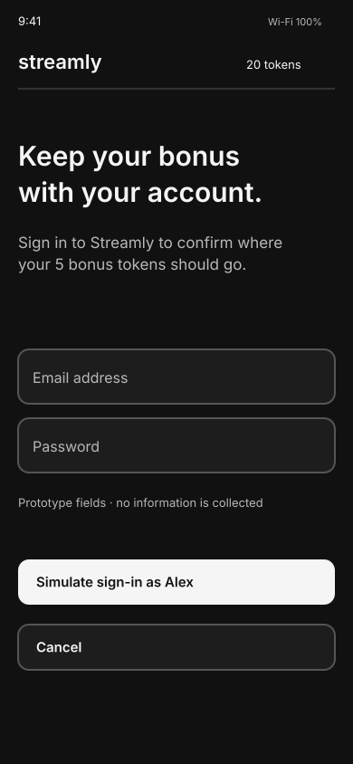

## EDGE-WALLET-20 — Wallet · more tokens needed

**Spendable balance: 20 tokens.** Reward availability is checked for Episode 4. Prices are illustrative. HD and other premium rewards are a future exploration.

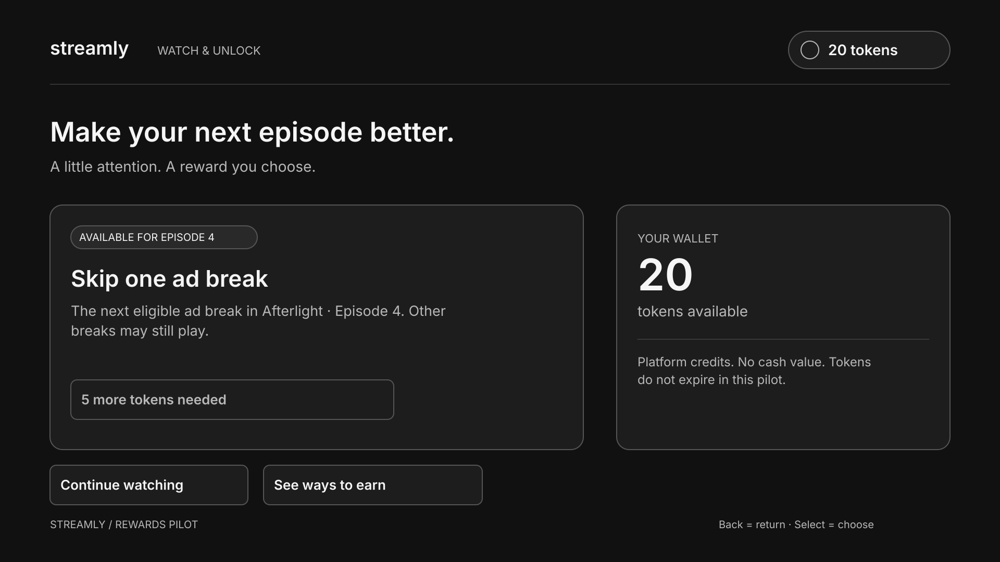

## EDGE-WALLET-5 — Wallet · more tokens needed

**Spendable balance: 5 tokens.** Reward availability is checked for Episode 4. Prices are illustrative. HD and other premium rewards are a future exploration.

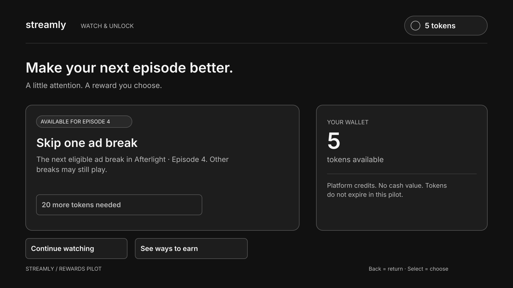

## EDGE-WALLET-0 — Wallet · more tokens needed

**Spendable balance: 0 tokens.** Reward availability is checked for Episode 4. Prices are illustrative. HD and other premium rewards are a future exploration.

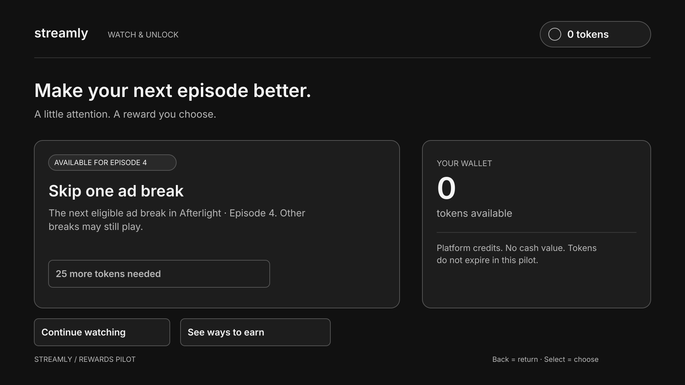

## EDGE-EXIT — Leave ad

**Spendable balance: 5 tokens.** You won’t earn the 15 ad tokens. Your 5 existing tokens are safe.

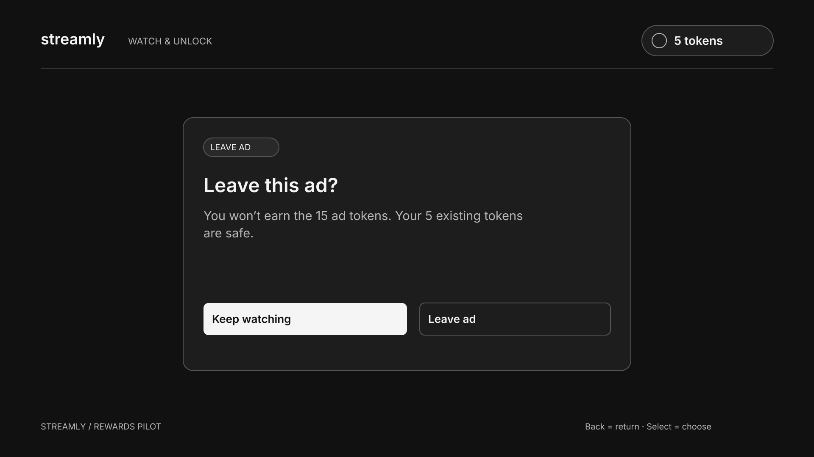

## EDGE-PENDING — Reward pending

**Spendable balance: 5 tokens.** Your 15 ad tokens are pending. Your spendable balance stays at 5 tokens until confirmation.

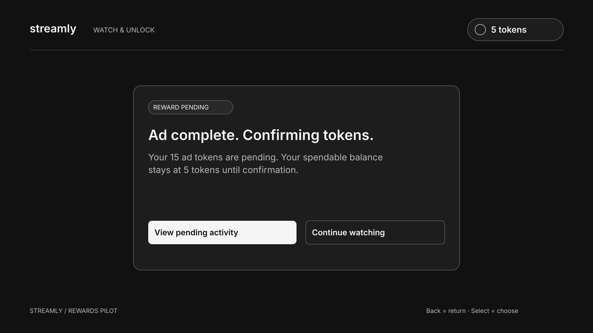

## EDGE-PENDING-ACTIVITY — Pending activity

**Spendable balance: 5 tokens.** Northstar Audio · Alex’s profile. The ad finished; confirmation is still in progress. No additional action is needed.

## EDGE-EXPIRED — QR code expired

**Spendable balance: 20 tokens.** This claim code has expired. Your 20 tokens are safe. Generate a new code to continue with the optional demo.

## EDGE-UNAVAILABLE — No reward ads

**Spendable balance: 5 tokens.** Your episode tokens are safe. You can continue watching and check for optional reward ads another time.

## EDGE-REFUND — Reward refunded

**Spendable balance: 25 tokens.** Your ad-break skip for Afterlight · Episode 4 wasn’t used within 24 hours. The tokens are available again.

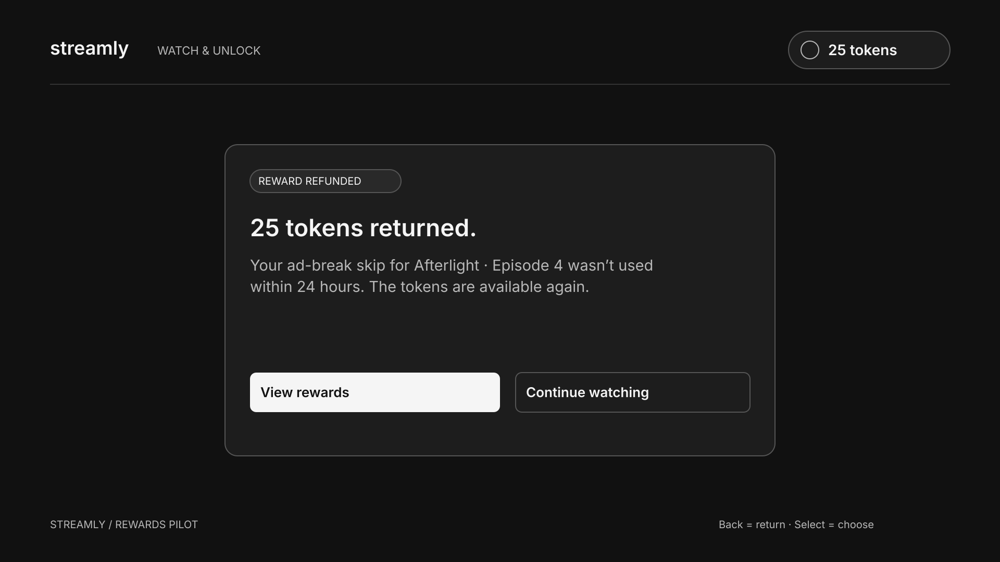

## EDGE-FAILED — Activation failed

**Spendable balance: 25 tokens.** No tokens were spent. Your balance is still 25 tokens. Try again or return to your rewards.

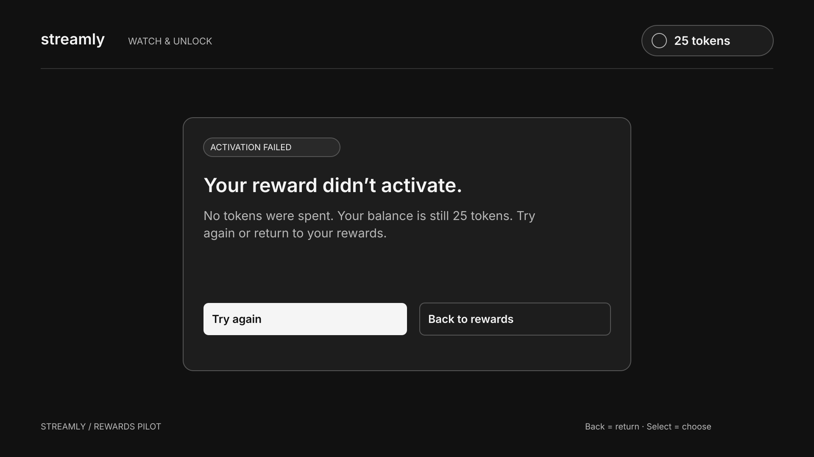

## PLAY-0 — Episode 4 playback

**Spendable balance: 0 tokens.** Playback artwork and delivery are simulated. Use the review toolbar to apply a reserved ad-break skip.

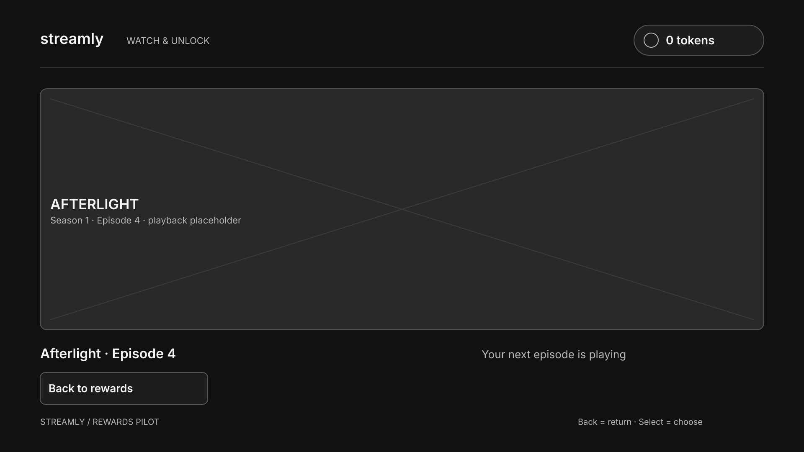

## PLAY-5 — Episode 4 playback

**Spendable balance: 5 tokens.** Playback artwork and delivery are simulated. Use the review toolbar to apply a reserved ad-break skip.

## PLAY-20 — Episode 4 playback

**Spendable balance: 20 tokens.** Playback artwork and delivery are simulated. Use the review toolbar to apply a reserved ad-break skip.

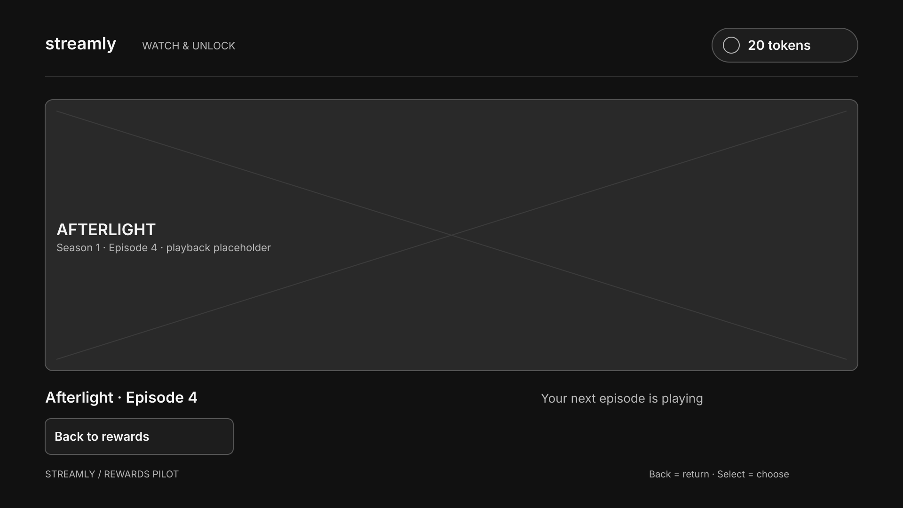

## PLAY-25 — Episode 4 playback

**Spendable balance: 25 tokens.** Playback artwork and delivery are simulated. Use the review toolbar to apply a reserved ad-break skip.

## PLAY-RESERVED — Episode 4 playback · reserved

**Spendable balance: 0 tokens.** Playback artwork and delivery are simulated. Use the review toolbar to apply a reserved ad-break skip.

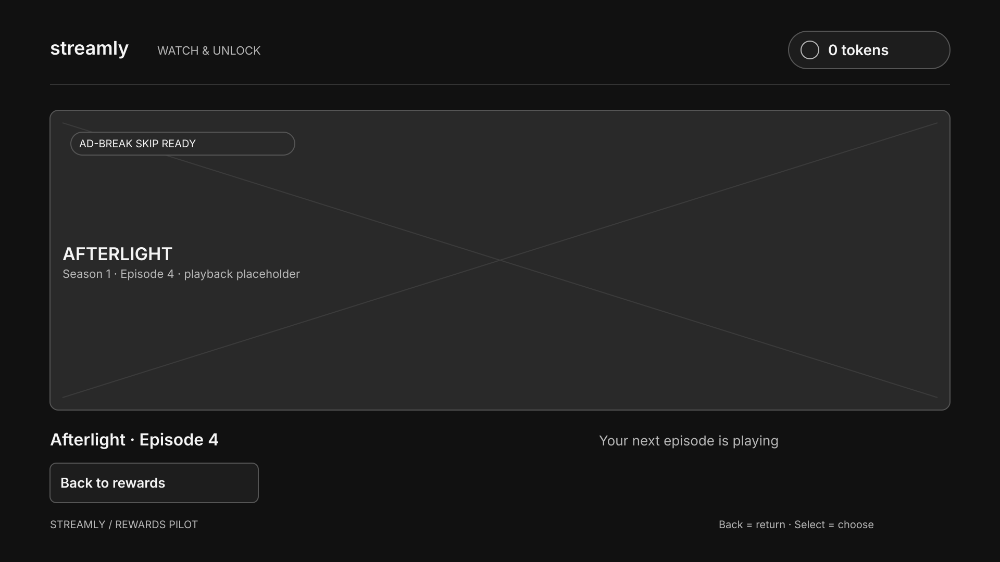

## PLAY-APPLIED — Episode 4 playback · applied

**Spendable balance: 0 tokens.** Playback artwork and delivery are simulated. Use the review toolbar to apply a reserved ad-break skip.

